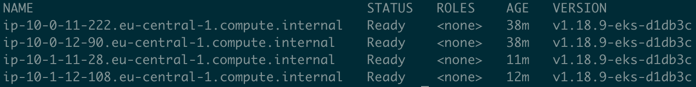

# The **REAL** EKS Anywhere

## Background

AWS released [EKS Distro on Dec 1, 2020](https://aws.amazon.com/blogs/aws/amazon-eks-distro-the-kubernetes-distribution-used-by-amazon-eks/) and [EKS Anywhere](https://aws.amazon.com/eks/eks-anywhere/) is coming in 2021.

We don't know too much details about how to use EKS Anywhere, but it's mainly designed to run EKS on-prem, so the one thing it probably lacks is, to create a multi-VPC EKS cluster, I.E., one control plane in one VPC, and multiple node groups in multiple VPCs.

So it's not really "EKS Anywhere". It's more of a wrapper on top of EKS Distro and it should be called EKS OnPrem.

## Here I Give You The REAL EKS Anywhere

With this set of Terraform automation, you can create one control plane in one account in one VPC, and create multiple node groups in any VPC to join the same cluster, as long as the VPC has connection to the VPC where the control plane is created (for example, VPC peering, transit gateway, etc.).

Or, you can [run the AMI on-premise](https://docs.aws.amazon.com/AWSEC2/latest/UserGuide/amazon-linux-2-virtual-machine.html) and as long as your on-prem infra can reach the control plane (by default it's public so yes), the worker can join the same cluster.

Or even you can import the VMs into GCP or Azure or what have you.

Hence, this is the **REAL** EKS Anywhere and I released it earlier.

## Notes

It's not official. Only a simple personal hobby work.

At the moment, due to restrictions from the EKS control plane, the traffic to other subnets which doesn’t belong to the VPC where the control plane lives are not properly routed, so you might experience time-outs when you try to do, for example, kubectl logs. For production-grade multi-VPC cluster, you might want to be able to manage your control plane as well, for example, with kops.

## Why Do We Need This

I'll write another article on this and put the link here later.

## How to Use

Follow each step, and there is a README (of course) under each step.

## Screenshot

Here we have TWO VPCs: 10.0.0.0/16 and 10.1.0.0/16.

The control plane is in the first VPC. There are two node groups, one in each VPC.

